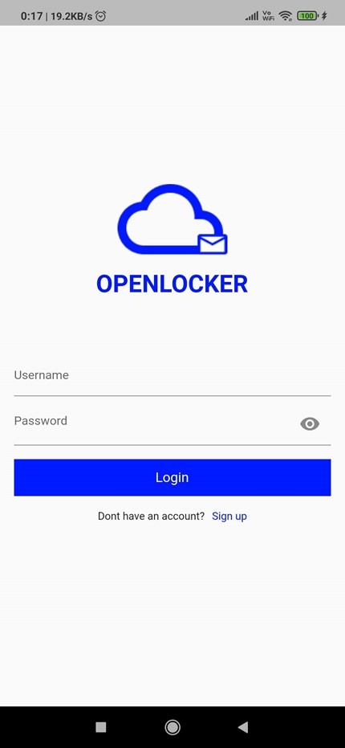
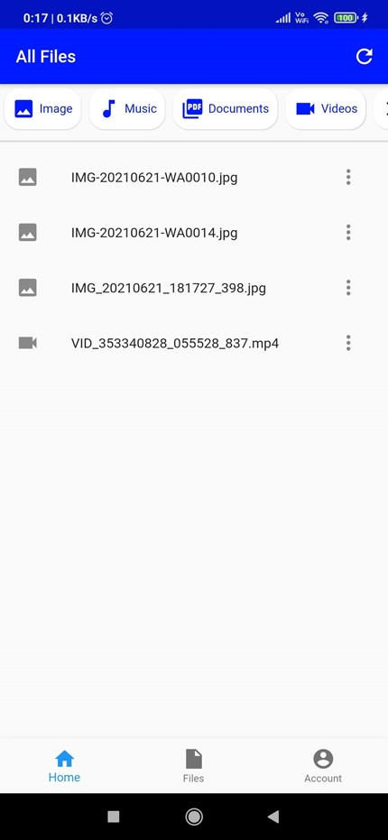
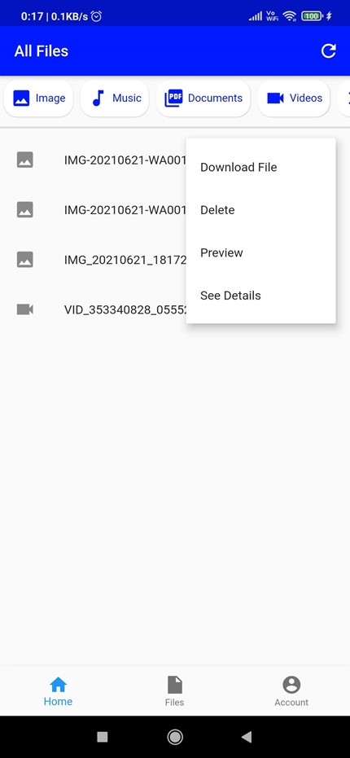

# Open Locker File Storage Solution

Open-Locker is a File Storage solution which focusses on the need for knowing
where a persons Files are being stored. It is an Open-Source software with
backend included which can be deployed by the user at their preferred cloud
storage option which their preferred setting or they can always host it
themselves.

This project contains multiple repositories which each perform their respected
tasks.

[Mobile Application](https://github.com/gat786/openlocker-app)

[Backend Repository](https://github.com/gat786/OpenLockerWebApi) 
Written in Dotnet Core

[Website](https://github.com/gat786/OpenLockerWeb) Website currently under construction

## Screenshots

Here are a few screenshots of how the application actually looks

